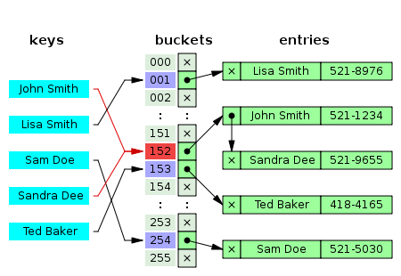

# Hash Tables

Python -> dictionary

`basket.grapes = 1000` -> key/value

- key : where to find value
- hash function(black box) -> index(key), value on our memory
- value : 1000

<br/>

### Hash Function

- 암호화
- **really fasy data access**
  - MD5 Hash
  - SHA1 Hash

<br/>

### BIG O

- Insert : O(1)
- Lookup : O(1)
- Delete : O(1)
- Search : O(1)

<br/>

```javascript
let user = {
  age: 54,
  name: 'Kyle',
  magix : true,
  screa: function () {
    console.log('ahhhhhh!');
  }
}

user.age //O(1)
user.spell = 'abra kadabra';	//add -> O(1)
user.scream();	//O(1)
```

<br/>

### Hash Collision

입력은 무한하지만 출력값의 가짓값은 유한하므로(key) 반드시 해시 충돌이 발생한다(**비둘기집 원리**)



- O(n)

- How to deal with
  - Chaining(체이닝)
    - 버켓 내에 연결리스트를 할당하여 버켓에 데이터를삽입하다가 **해시충돌 발생시 연결리스트로 데이터를 연결하는 방식**
    - **+** : 연결리스트만 사용, 단순, 채워질 수록 성능저하가 Linear하게 발생
  - Open Addressing(개방 주소법)
    - 주소값이 변하지 않는 체이닝과 달리 해시 충돌이 일어나면 다른 버켓에 데이터를 삽입
    - 선형탐색 : 다음, 몇 개를 넘긴 위치 버켓에 저장
    - 제곱탐색 : 제곱만큼
    - 이중해시 : 해시충돌시 다른 해시 함수를 한번 더 사용
    - **+** :  필요없고 지정한 메모리 외 추가 저장 공간도 없음, 삽입/삭제 오버헤드 적다, 데이터가 적을때

<br/>

<br/>

### in Javascipt

Map, Object, Set(before ES6)

```javascript
const a = new Map()	// 다양한 형식, object{} -> 기호나 문자, size사용가능
const b = new Sets()
```

### Chanllenge 

hash table -> **set, get**

```javascript
class HashTable{
  constructor(size){
    this.data = new Array(size);
  }
  _hash(key){		//_ => private property
    let hash = 0;
    for (let i =0; i<key.length; i++){
      hash = (hash + key.charCodeAt(i) * i) % this.data.length;	//charCodeAt->encode
    }
    return hash;
  }
  
  set(key, value){	//O(1)
    let address = this._hash(key);
    if(!this.data[address]){
    	this.data[address] = [];
    }else{
      this.data[address].push([key,value]);
      return this.data;
    }
  }
  
  get(key){
    let address = this._hash(key);
    const currentBucket = this.data[address];
    if (currentBucket){		//could have multiple items
      for (let i=0; i<currentBUcket.length; i++){		// could be O(n)
        if(currentBucket[i][0] === key){
          return currentBucket[i][1];
        }
      }
    }	//if no collision -> O(1)
    return undefined;
  }
}

const myHashTable = new HashTable(50);
myHashTable.set('grapes', 10000);
myHashTable.set('apples', 10000);
myHashTable.get('grapes');
```

