### AVL Tree

- BF(Balance Factor)를 통해 균형을 맞춘다
- BF는 -1, 0, 1로 이루어져있다
- 왼쪽 서브 트리에서 오른쪽 서브트리를 뺀 값이 그 노드의 BF가 된다

BF 값을 통한 균형은 *rotation*을 통해 이루어진다.
rotation은 BF가 2 이상, -2 이하로 바뀐 노드를 기준으로 rotation이 이루어진다.

**Balanced Tree and Unbalanced Tree**

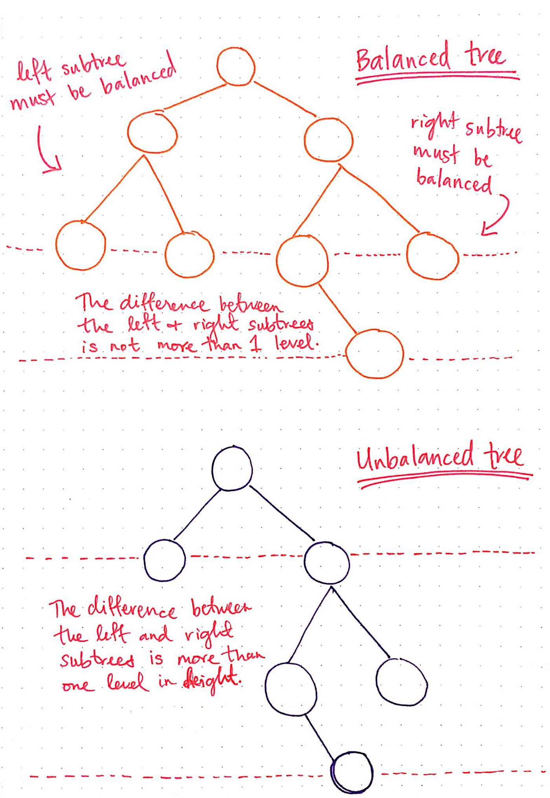

 

**process**

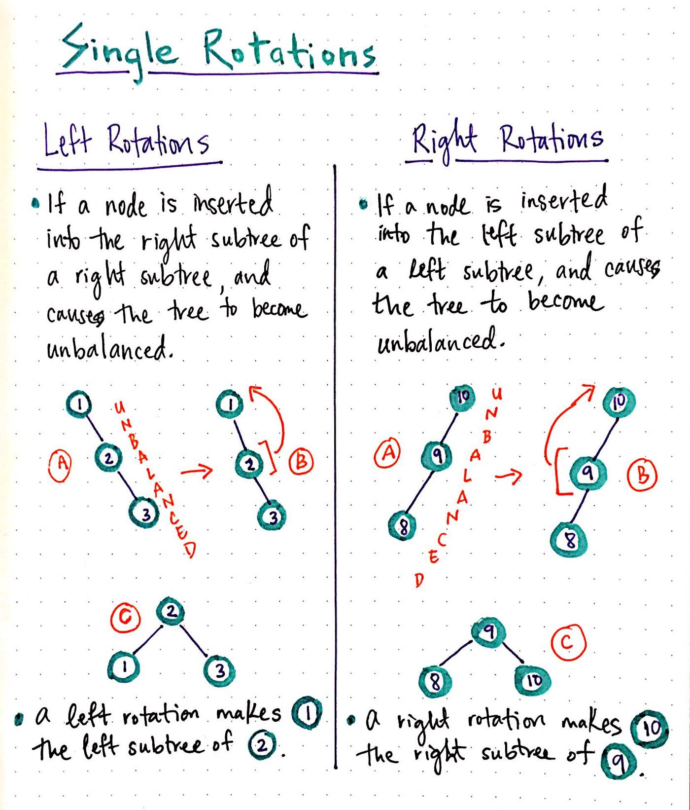

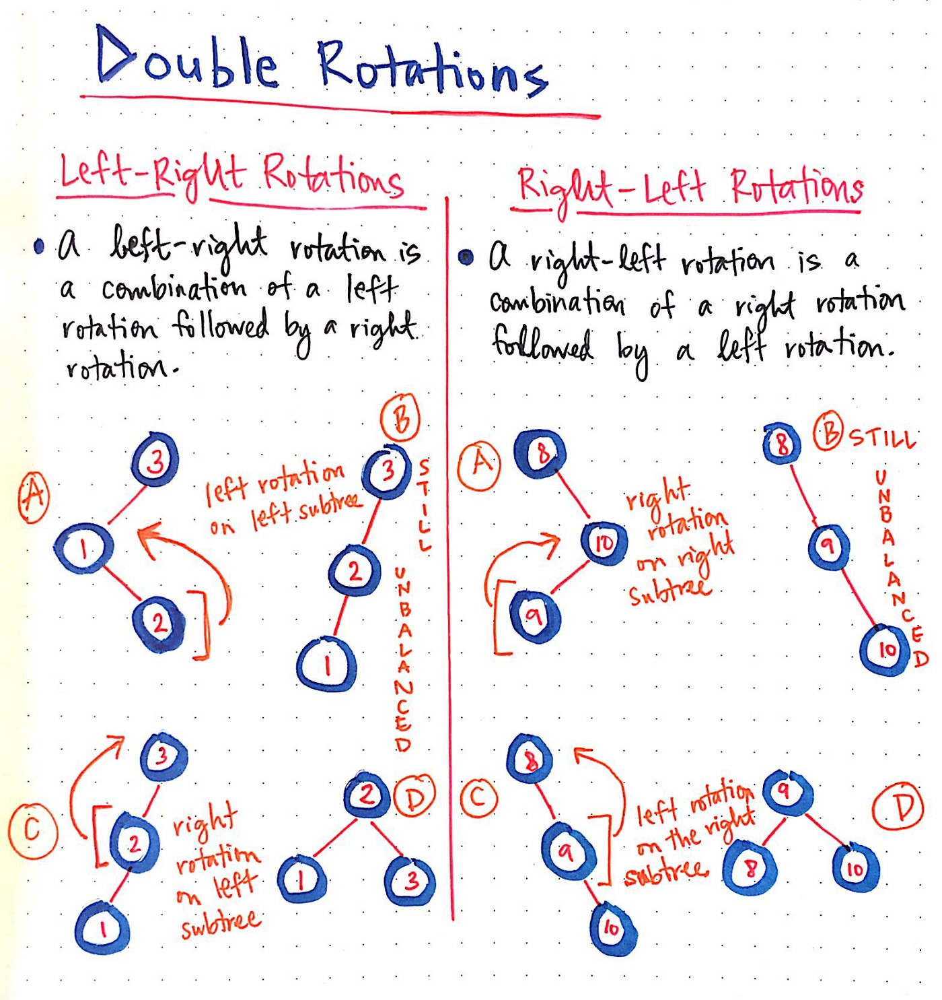

 

 

### Red-Black Tree

**rules**

1. 모든 트리의 노드는 레드/블랙

2. 루트 노드는 무조건 블랙

3. 두 개의 레드 노드는 연속으로 나타날 수 없다. 항상 블랙노드를 부모와 자식으로 가지고 있어야 한다

4. 루트 노드에서 리프 노드까지 블랙 노드의 갯수는 항상 같다

5. 마지막은 비어있는 리프노드는 블랙노드로 간주된다

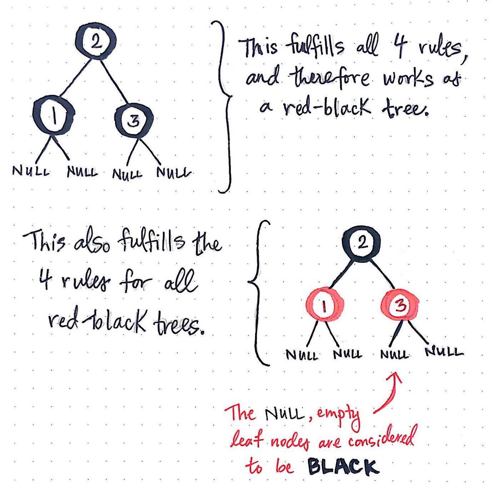

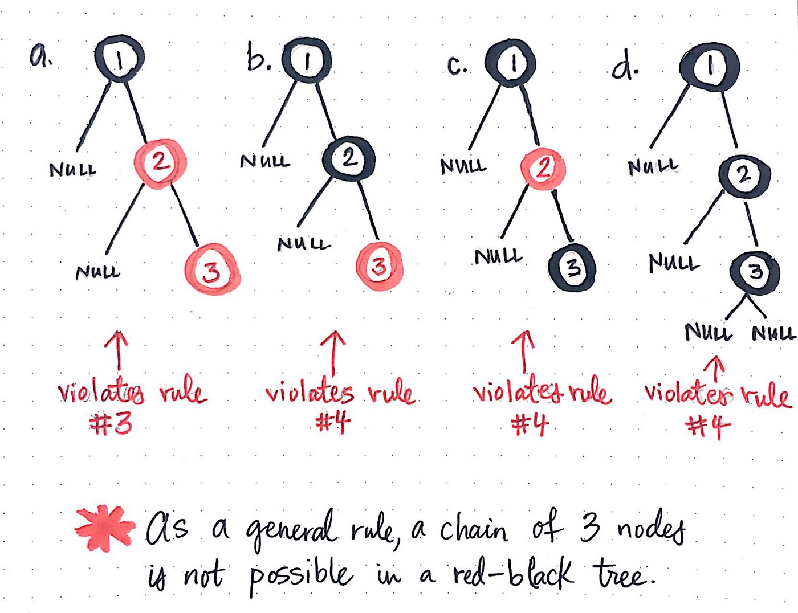

-> 세 개의 노드에서 파생된 레드-블랙 트리는 유효할 수 없다

 

**Recoloring, Restructuring**

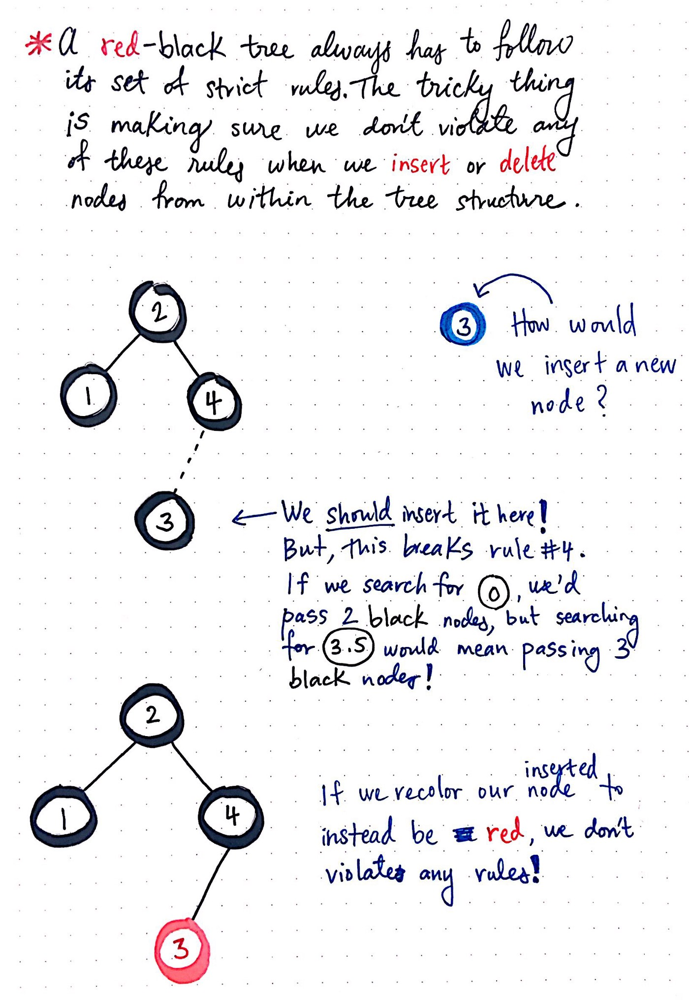

-> recoloring 노드들은 삽입또는 삭제를 처리하는데 잘 사용되는 기법 중 하나이다 

- 이진탐색트리의 방식으로 삽입
- 우선 레드로 칠한다
- 규칙에 맞추어 회전

**process**

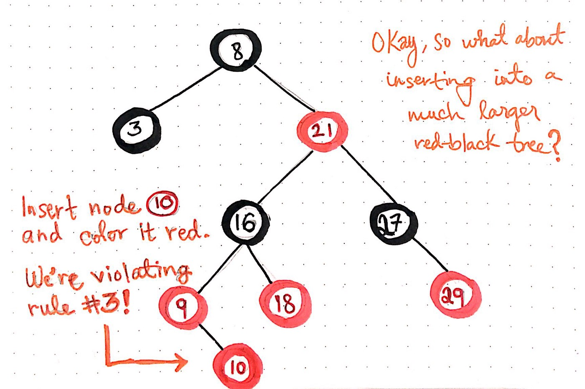

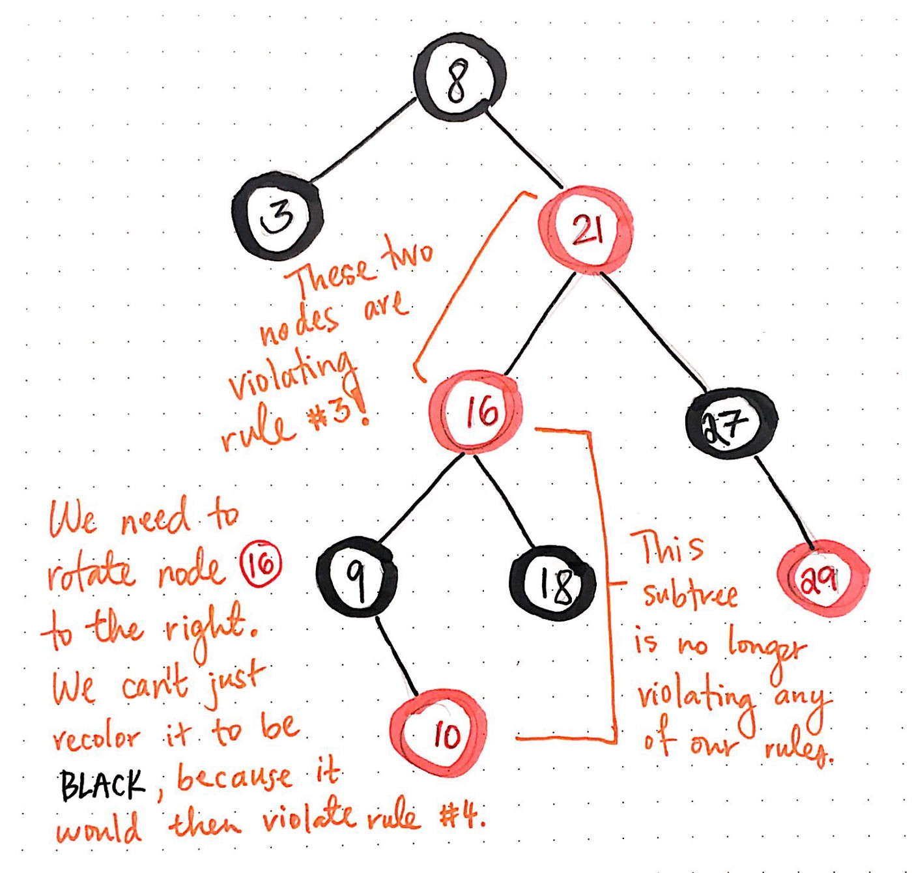

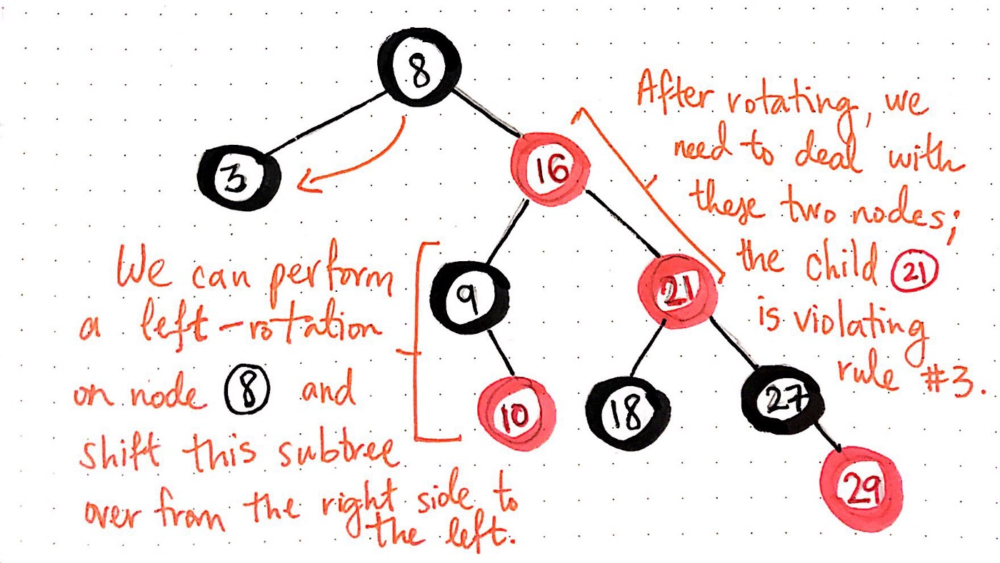

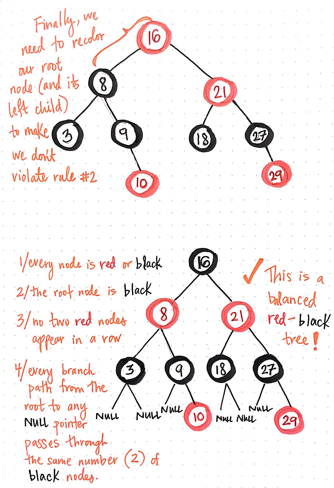

 

**BIG O**

삽입, 삭제, 검색하는 평균 및 최악의 시간복잡도가 항상 O(log N)을 보장한다

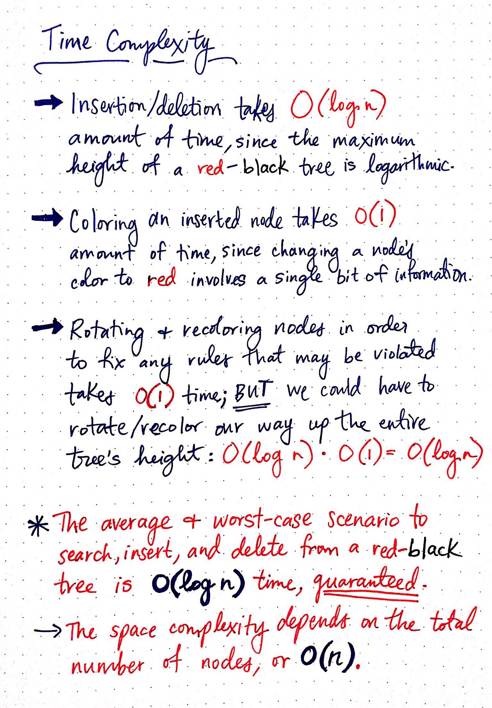

 

### Red-Black vs AVL

- AVL트리는 더욱 엄격한 균형을 이루고 있기 때문에 Red-Black 트리보다 더 빠른 조회를 제공
- Red-Black 트리는 상대적으로 느슨한 균형으로 인해 회전이 거의 이루어지지 않기 때문에 AVL트리보다 빠르게 삽입 및 제거 작업을 수행
- AVL트리는 각 노드에 대해 BF를 저장하므로 노드 당 int 저장이 필요
  Red-Black 트리는 노드당 1비트의 정보만 필요 (플래그 반전만 시키면 됨)
- Red-Black 트리는 맵, C++의 멀티캐스트, Java treeMap 등 대부분의 언어 라이브러리에서 사용, AVL트리는 더 빠른 검색이 필요한 데이터베이스에서 사용

