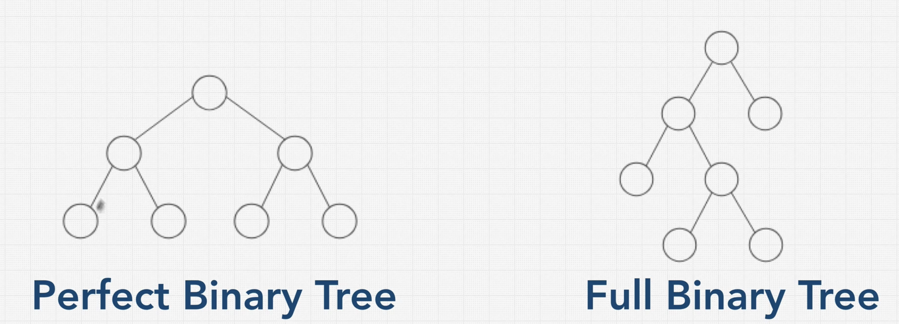
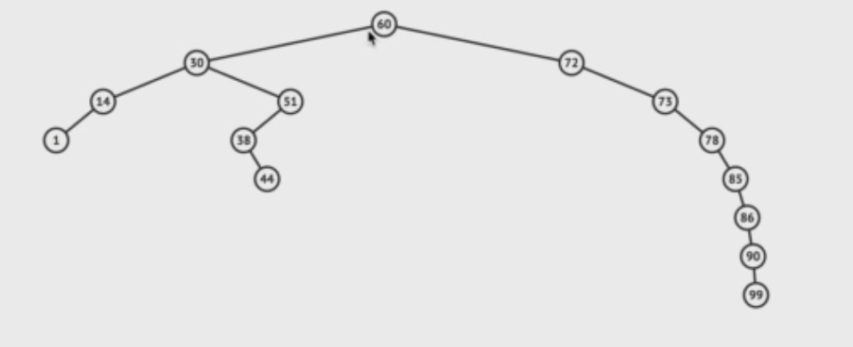

# Trees

- 계층구조
- Parent-Child relationship
- Subtree
- DOM -> Tree Data Structure
- linked list -> 트리의 일종, one path
- BST : 모든 값들이 크기를 기준으로 노드들에 의해 분류(중복값X)
- Balanced
- Complete Binary Tree : 트리 레벨별로 좌측부터 노드가 채워지는 이진트리
- Full Binary Tree : 노드가 자식을 가질거면 2개의 자식 모두를 가지거나 하나도 가지지 않는 트리
- Perfect Binary Tree : 모든 노드가 두개의 Child를 가지며 정확한 피라미드 모양을 가지는 이진트리
  - 총 노드의 수 : 2^n -1


<br/>

### binary Trees

- 각 노드는 0, 1, 2 (자식)노드를 가진다

```javascript
function BinaryTreeNode(value){
  this.value = value;
  this.left = null;
  this.right = null;
}
```



**Perfect Binary Tree(포화 이진 트리)**

- 효율적
- next level -> double nodes (x2)
- 마지막 노드의 수 = 나머지 (레벨)노드의 수 +1
- lookup, insert, delete -> O(log N)
- Level 0의 노드의 수 : 2^0 = 1
- Level 1의 노드의 수 : 2^1 = 2
- 총 노드의 수 : 2^높이(level+1) - 1
  - log nodes = height

<br/>

### binary search tree

😃 : Better than O(n), Ordered, Flexible Size

😱 : No O(1) Operation 

lookup, insert, delete -> O(log N)

Insert -> traversing nodes

1. currentnode 보다 right child node가 더 크다(left는 더 작아진다)
2. node는 두 개까지 자식노드를 가질 수 있다 -> lookup

<br/>

### balanced vs unbalanced BST



unbalanced BST -> lookup, insert, delete -> O(n) -> how do you balanced?

-> AVL, Red Black Tree ...

<br/>

**remove is not easy to understand, focus on insert, lookup**

```javascript
class Node{
  constructor(value){
    this.left = null;
    this.right = null;
    this.value = value;
  }
}

class BinarySearchTree{
  constructor(){
    this.root = null;
  }
  
  insert(value){
  	const newNode = new Node(value);
    if (this.root === null){
      this.root = newNode;
    }else{
      let currentNode = this.root;	//ready to traverse(point)
      while(true){
        if(value < currentNode.value){
          //Left
          if(!currentNode.left){
            currentNode.left = newNode;
            return this;
          }
          currentNode = currentNode.left;
        }else{
          //Right
          if(!currentNode.right){
            currentNode.right = newNode;
            return this;
          }
          currentNode = currentNode.right;
        }
      }
    }
  }
  
  lookup(value){
    if (!this.root){
      return false;
    }
    let currentNode = this.root;
    while(currentNode){
      if(value < currentNode.value){
        currentNode = currentNode.left;
      }else if(value > currentNode.value){
        currentNode = currentNode.right;
      }else if (currentNode.value === value){
        return currentNode;
      }
    }
    return false;
  }
  
  //remove
  remove(value){
    if(!this.root){
      return false;
    }
    let currentNode = this.root;
    let parentNode = null;
    while(currentNode){
      if(value < currentNode.value){
        parentNode = currentNode;
        currentNode = currentNode.left;
      }else if(value > currentNode.value){
        parentNode = currentNode;
        currentNode = currentNode.right;
      }else if(value === currentNode.value){
        //we have a match, get to work!
        
        //option1 : No right child
        if (currentNode.right === null){
          if (parentNode === null){
            this.root = currentNode.left;
          }else{
            // if parent > current value, make current left child a child of a parent
            if(currentNode.value < parentNode.value){
              parentNode.left = currentNode.left;
            }	//if parent < current value, make left child a right child of a parent
            else if (currentNode.value > parentNode.value){
              parentNode.right = currentNode.left;
            }
          }
        }//option2 : Right child which doesnt have a left child 
        else if (currentNode.right.left === null){
          if(parentNode === null){
            this.root = currentNode.left;
          } else{
            currentNode.right.left = currentNode.left;
            
            //if parent > current, make right child of the left the parent
            if (currentNode.value < parentNode.value){
              parentNode.left = currentNode.right;
            }
            //if parent < current, make right child a right child of the parent
            else if (currentNode.value > parentNode.value){
              parentNode.right = currentNode.right;
            }
          }
        }//option3 : Right child that has a left child 
        else{
          // find the right child's left most child
          let leftmost = currentNode.right.left;
          let leftmostParent = currentNode.right;
          while(leftmost.left !== null){
            leftmostParent = leftmost;
            leftmost = leftmost.left;
          }
          
          //parent's left subtree is now leftmost's right subtree
          leftmostParent.left = leftmost.right;
          leftmost.left = currentNode.left;
          leftmost.right = currentNode.right;
          
          if(parentNode === null){
            this.root = leftmost;
          }
          else{
            if (currentNode.value < parentNode.value){
              parentNode.left = leftmost;
            }else if (currentNode.value > parentNode.value){
              parentNode.right = leftmost;
            }
          }
        }
        return true;
      }
    }
  }
}

const tree = new BinarySearchTree();
tree.insert(9)
tree.insert(4)
tree.insert(6)
tree.insert(20)
tree.insert(170)
tree.insert(15)
tree.insert(1)
//JSON.stringify(traverse(tree.root))

//     9
//  4     20
//1  6  15  170

//later...
function traverse(node) {
  const tree = { value: node.value };
  tree.left = node.left === null ? null : traverse(node.left);
  tree.right = node.right === null ? null : traverse(node.right);
  return tree;
}
```

<br/>

### Binary Heaps

😃 : Better than O(n), Priority, Flexible Size, Fast Insert

😱 : Slow Lookup

- heap = 쌓여있는 더미
- 최대 이진 힙(MaxBinaryHeap)에서는 부모 노드가 항상 자식 노드들보다 커야 한다
- 최소 이진 힙(MinBinaryHeap)에서는 부모 노드가 항상 자식 노드들보다 작아야 한다
- 형제노드간에는 규칙이 없다

- lookup -> O(n), insert/delete ->  O(log N)

<br>

**parent/child**

- 부모의 위치(n)를 가지고 자식의 위치 찾기
  - `left child` 인덱스 : 2n+1
  - `right child` 인덱스 : 2n+2

- child 노드의 인덱스를 가지고 parent 노드의 인덱스를 찾기
  - 자식의 위치(n)를 가지고 부모의 위치 찾기
    - `parent` 인덱스 : Math.floor((n-1)/2)

<br/>

### Trie

문자열을 저장하고 효율적인 탐색을 위한 자료구조

검색엔진 사이트에서 제공하는 **자동 완성 및 검색어 추천 기능 등 문자열을 탐색하는 곳**에서 Trie 알고리즘을 사용

각 노드에서 자식에 대한 포인터들을 배열로 저장하므로 큰 저장 공간을 필요로 한다


