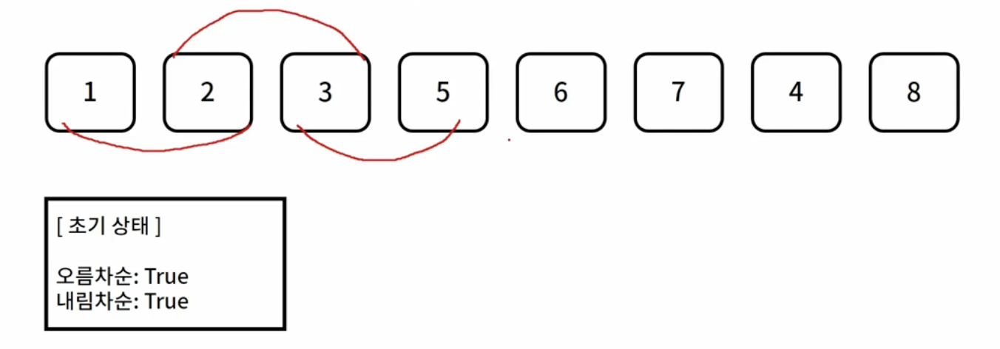

### 핵심 아이디어

1. 리스트에서 원소를 차례로 비교한다
2. 두 원소를 기준으로 오름차순, 내림차순 여부를 체크한다



증가하는 형태 -> 내림차순을 False

가다가 내려가면 -> 오름차순을 False

둘모두 False이면 mixed

```python
a = list(map(int, input().split(' ')))

ascending = True
descending = True

for i in range(1,8):
  if a[i] > a[i-1]:
    descending = False
  elif a[i] < a[i-1]:
    ascending = False
    
if ascending:
  print('ascending')
elif descending:
  print('descending')
else:
  print('mixed')
```

