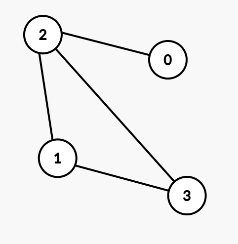

# Graphs

### Graph Introduction

😃 : Relationships

😱 : Scaling is hard

*tree is type of graphs*


- Directed Graph | Undirected Graph
- Weighted Graph | Unweighted Graph
- Cyclic Graph | Acyclic Graph

<br>

### Graph Data



```javascript
//Edge List
const graph = [[0,2], [2,3], [2,1], [1,3]];

//Ajacent List
const graph = [[2], [2,3], [0,1,3], [1,2]];	//index 0 -> 2, 1 -> 2,3 ...

//Ajacent Matrix
const graph = {		//index 0 -> 2, 1 -> 2,3 ...
  0: [0, 0, 1, 0],
  1: [0, 0, 1, 1],
  2: [1, 1, 0, 1],
  3: [0, 1, 1, 0]
}
```

<br/>

### Graph Implementation

Undirected, Unweighted


```javascript
class Graph { 
  constructor() { 
    this.numberOfNodes = 0;
    this.adjacentList = {
    }; 
  } 
  addVertex(node)  {
    this.adjacentList[node] = [];	//adding [key] = value(array)
    this.numberOfNodes++;
  } 
  
  addEdge(node1, node2) { 
    //undirected Graph
    this.adjacentList[node1].push(node2);
    this.adjacentList[node2].push(node1);	//undirected graph connected both
  } 
  
  showConnections() { 
    const allNodes = Object.keys(this.adjacentList); 
    for (let node of allNodes) { 
      let nodeConnections = this.adjacentList[node]; 
      let connections = ""; 
      let vertex;
      for (vertex of nodeConnections) {
        connections += vertex + " ";
      } 
      console.log(node + "-->" + connections); 
    } 
	} 
} 

const myGraph = new Graph();
myGraph.addVertex('0');
myGraph.addVertex('1');
myGraph.addVertex('2');
myGraph.addVertex('3');
myGraph.addVertex('4');
myGraph.addVertex('5');
myGraph.addVertex('6');
myGraph.addEdge('3', '1'); 
myGraph.addEdge('3', '4'); 
myGraph.addEdge('4', '2'); 
myGraph.addEdge('4', '5'); 
myGraph.addEdge('1', '2'); 
myGraph.addEdge('1', '0'); 
myGraph.addEdge('0', '2'); 
myGraph.addEdge('6', '5');

myGraph.showConnections(); 
//Answer:
// 0-->1 2 
// 1-->3 2 0 
// 2-->4 1 0 
// 3-->1 4 
// 4-->3 2 5 
// 5-->4 6 
// 6-->5
```

