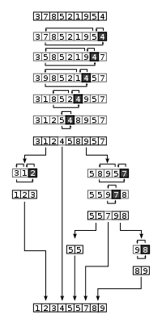

# Sorting

### Issue with sort()

자바스크립트의 sort() 메서드는 배열의 요소를 적절한 위치에 정렬한 후 그 배열을 반환

기본정렬 순서는 문자열의 유니코드 포인트를 따른다

compareFunction이 제공되지 않으면 요소를 문자열로 변환하고 유니코드 포인트 순서로 문자열을 비교하여 정렬

```javascript
//
function compare(a,b){
  if (a < b) return -1;	//a b 순서
  if (a > b) return 1;	// b a 순서
  ㅑif (a==b) return 0;	//그대로
}

//오름차순 정렬
function compareNumbers(a,b){
  return a-b;
}

//내림차순 정렬
function compareNumbers(a,b){
  return b-a;
}
```

```javascript
const basket = [2, 65, 34, 2, 1, 7, 8];

basket.sort(function(a,b){
  return a.localeCompare(b);
})

// 'a'.localeCompare('b'); -> -1
```

<br/>

### Bubble Sort

**BIG O**

- Time Complexity : best - O(n), average/worst - O(n^2) 

- Space Complexity : worst - O(1)
- stable algorithms -> 중복요소의 위치가 유지되는 정렬

```javascript
const numbers = [99, 44, 6, 2, 1, 5, 63, 87, 283, 4, 0];

function bubbleSort(array){
  for(let i=0; i< array.length; i++){
    for(let j=1; j< array.length-i; j++){
      if (array[j] < array[j-1]){
        let tmp = array[j]
        array[j] = array[j-1]
        array[j-1] = tmp
      }
    }
  }
}

bubbleSort(numbers);
console.log(numbers);
```

<br/>

### Selection Sort

- Time Complexity : best - O(n^2), average/worst - O(n^2) 

- Space Complexity : worst - O(1)


```javascript
const numbers = [99, 44, 6, 2, 1, 5, 63, 87, 283, 4, 0];

function selectionSort(array){
  for (let i=0; i<numbers.length; i++){
  	let min = i;
    let tmp = array[i];
    for (let j=i+1; j<numbers.length; j++){
      if(array[min] > array[j]){
        min = j;
      }
    }
    array[i] = array[min];
    array[min] = tmp;
  }
}

selectionSort(numbers);
```

<br/>

### Insertion Sort

- Time Complexity : best - O(n), average/worst - O(n^2) 
- Space Complexity : worst - O(1)
- 데이터의 규모의 크기가 작을 경우, 거의 정렬되었을 경우 빠른 속도를 낼 수 있다

새로운 요소를 기존 정렬된 카드 사이의 올바른 자리에 넣는다

매 순서마다 해당 원소를 삽입 할 수 있는 위치를 찾아 삽입

```javascript
const numbers = [99, 44, 6, 2, 1, 5, 63, 87, 283, 4, 0];

function insertionSort(numbers){
  for (let i=0; i<numbers.length; i++){
    if (array[i] < array[0]){
      // move numbers to first position
      array.unshif(array.splice(i,1)[0]);
    }else{
      // only sort number smaller than number on the left of it.
      for (let j=1; j<i;j++){
        if (array[i] > array[j-1] && array[i] < array[j]){
          array.splice(j,0,array.splice(i,1)[0]);
        }
      }
    }
  }
}

insertionSort(numbers);
console.log(numbers);
```

<br/>

### Merge Sort and O(n log n)

**merge sort and quick sort -> Divide & Conquer**

reverse Tree

- log N : 트리


```javascript
const numbers = [99, 44, 6, 2, 1, 5, 63, 87, 283, 4, 0];

function mergeSort(array){
  if (array.length === 1){
    return array;
  }
  // split array in into right and left
  const length = array.length;
  const middle = Math.floor(length/2);
  const left = array.slice(0,middle);
  const right = array.slice(middle);
  
  return merge(
  	mergeSort(left),
    mergeSort(right)
  )
} 

function merge(left, right){
  const result = [];
  let leftIndex = 0;
  let rightindex = 0;
  while(leftIndex < left.length && rightIndex < right.length){
    if(left[leftIndex] < right[rightIndex]){
      result.push(left[leftIndex]);
      leftIndex++;
    }else{
      result.push(right[rightIndex]);
      rightIndex++;
    }
  }
  return result.concat(left.slice(leftIndex)).concat(right.slice(rightIndex))
}

const answer = mergeSort(numbers);
console.log(answer);
```

<br/>

### Quick Sort

Divide and Conquer -> O(n log n)

useful algorithms

- pivot, partitioning




```javascript
const numbers = [99, 44, 6, 2, 1, 5, 63, 87, 283, 4, 0];

function quickSort(array, left, right){
  const len = array.length; 
  let pivot;
  let partitionIndex;

  if(left < right) {
    pivot = right;
    partitionIndex = partition(array, pivot, left, right);
    
    //sort left and right
    quickSort(array, left, partitionIndex - 1);
    quickSort(array, partitionIndex + 1, right);
  }
  return array;
}
   
function partition(array, pivot, left, right){
  let pivotValue = array[pivot];
  let partitionIndex = left;

  for(let i = left; i < right; i++) {
    if(array[i] < pivotValue){
      swap(array, i, partitionIndex);
      partitionIndex++;
    }
  }
  swap(array, right, partitionIndex);
  return partitionIndex;
}

function swap(array, firstIndex, secondIndex){
    var temp = array[firstIndex];
    array[firstIndex] = array[secondIndex];
    array[secondIndex] = temp;
}

//Select first and last index as 2nd and 3rd parameters
quickSort(numbers, 0, numbers.length - 1);
console.log(numbers);
```

<br/>

### Which Sort is Best?

**Insertion Sort** : 요소의 크기가 작을 때, 거의 정렬되어 있을때

**bubble Sort, Selection Sort** : NO

**Merge Sort** : dataset이 큰데 컴퓨터 메모리 외부에서 정렬을 수행가능할 때(단점 공간복잡도 해결), 정확도가 의심가거나 적절한 pivot을 찾기 어려울때

**Quick Sort** : dataset이 크고 적절한 피봇선정이 가능할 때

<br/>


<br/>

### Heap Sort

<br/>

### Radix Sort + Counting Sort

Non Comparison Sort

<br/>

### Sorting Interview

```javascript
//#1 - Sort 10 schools around your house by distance:
insertion sort
input된 dataset의 크기가 무척 작기 때문에 Insertion Sort가 가장 빠르고, 공간복잡도도 효율적이다.

//#2 - eBay sorts listings by the current Bid amount:
radix or counting sort
bid는 숫자형 데이터이고, 대부분 정수일 가능성이 높으므로 Radix 또는 Counting Sort를 사용하면 좋다.

//#3 - Sort scores on ESPN
Quick sort
Quick, Merge Sort 크게 상관 없지만, 공간복잡도가 부담될 수 있을 것 같아 Quick을 사용한다.

//#4 - Massive database (can't fit all into memory) needs to sort through past year's user data
Merge Sort
1) Dataset의 크기가 방대하고, 2) 또 메모리 외부에서 작업하게 되므로 Merge Sort가 최적이다.

//#5 - Almost sorted Udemy review data needs to update and add 2 new reviews
Insertion Sort
대량의 데이터이지만, 거의 정렬이 되어있기 때문에 Insertion Sort를 사용한다.

//#6 - Temperature Records for the past 50 years in Canada
radix or counting Sort
Quick sort if decimal places
Radix나 Counting을 사용할 수 있지만, 온도의 경우 소수점도 포함될 수 있으므로 그럴 땐 Quick Sort.

//#7 - Large user name database needs to be sorted. Data is very random.
Quick sort
Merge sort도 무관하다.
```

 
