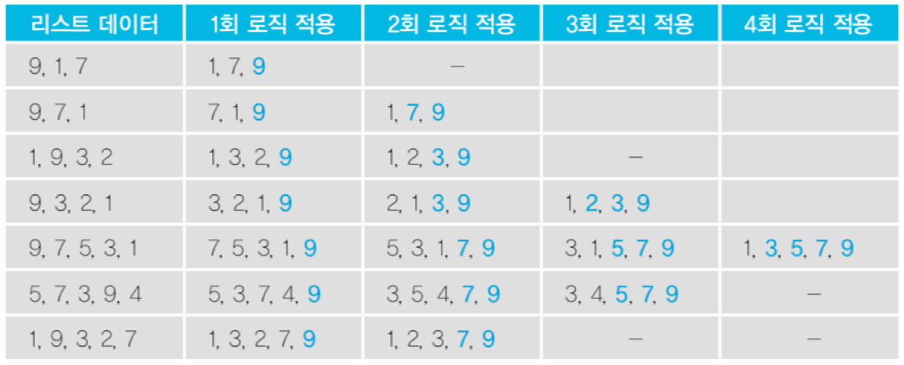

<div class="alert alert-block alert-info">
<center><strong><font size=4em>알고리즘 연습 방법</font></strong></center>
<font size=3em>1. 연습장과 펜을 준비하자.</font><br><br>
<font size=3em>2. 알고리즘 문제를 읽고 분석한 후에,</font><br><br>
<font size=3em>3. 간단하게 테스트용으로 매우 간단한 경우부터 복잡한 경우 순서대로 생각해보면서, 연습장과 펜을 이용하여 알고리즘을 생각해본다.</font><br><br>
<font size=3em>4. 가능한 알고리즘이 보인다면, 구현할 알고리즘을 세부 항목으로 나누고, 문장으로 세부 항목을 나누어서 적어본다.</font><br><br>
<font size=3em>5. 코드화하기 위해, 데이터 구조 또는 사용할 변수를 정리하고,</font><br><br>
<font size=3em>6. 각 문장을 코드 레벨로 적는다.</font><br><br>
<font size=3em>7. 데이터 구조 또는 사용할 변수가 코드에 따라 어떻게 변하는지를 손으로 적으면서, 임의 데이터로 코드가 정상 동작하는지를 연습장과 펜으로 검증한다.</font><br>
</div>

<br/>

<br/>

### 2. 버블 정렬 (bubble sort) 란?
* 두 인접한 데이터를 비교해서, 앞에 있는 데이터가 뒤에 있는 데이터보다 크면, 자리를 바꾸는 정렬 알고리즘

#### 직접 눈으로 보면 더 이해가 쉽다: https://visualgo.net/en/sorting


> 출처: https://en.wikipedia.org/wiki/Bubble_sort

<br/>

### 4. 알고리즘 구현
* **특이점 찾아보기**
  - n개의 리스트가 있는 경우 최대 n-1번의 로직(비교)을 적용한다.
  - 로직을 1번 적용할 때마다 가장 큰 숫자가 뒤에서부터 1개씩 결정된다.
  - 로직이 경우에 따라 일찍 끝날 수도 있다. 따라서 로직을 적용할 때 한 번도 데이터가 교환된 적이 없다면 이미 정렬된 상태이므로 더 이상 로직을 반복 적용할 필요가 없다.
  

<br/>

	1. for num in range(len(data_list)) 반복
	2. swap = 0 (교환이 되었는지를 확인하는 변수를 두자)
	3. 반복문 안에서, for index in range(len(data_list) - num - 1) n - 1번 반복해야 하므로
	4. 반복문안의 반복문 안에서, if data_list[index] > data_list[index + 1] 이면
	5. data_list[index], data_list[index + 1] = data_list[index + 1], data_list[index]
	6. swap += 1
	7. 반복문 안에서, if swap == 0 이면, break 끝
```python
def bubblesort(data):
    for index in range(len(data) - 1):
        swap = False
        for index2 in range(len(data) - index - 1):
            if data[index2] > data[index2 + 1]:
                data[index2], data[index2 + 1] = data[index2 + 1], data[index2]
                swap = True
        
        if swap == False:
            break
    return data
```

<br/>